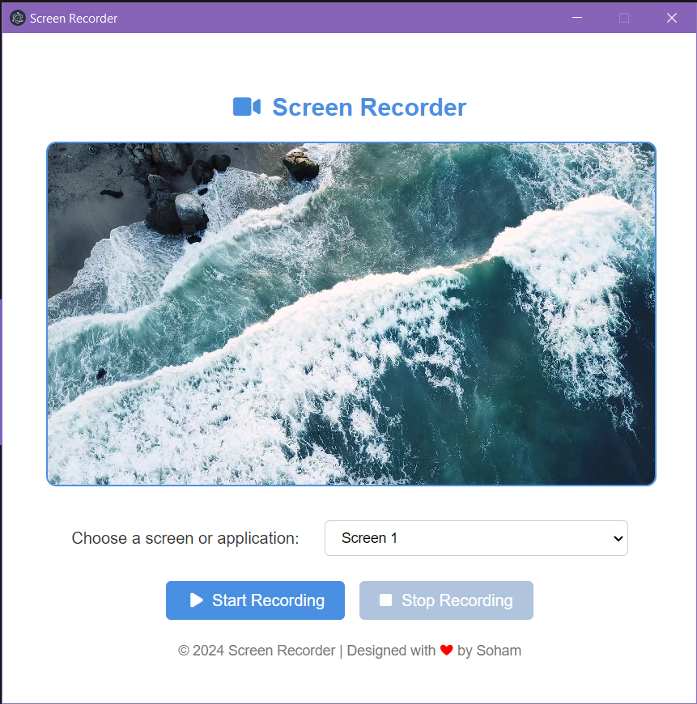

# Screen Recorder App

<!--  -->

https://github.com/user-attachments/assets/b70c1783-87ac-41da-81e7-062419b49015

A simple and efficient screen recorder app built with [Electron](https://www.electronjs.org/). Record your screen with ease and export videos in high quality. This app is perfect for tutorials, demos, or capturing anything on your screen.

## Features

- Record full screen or specific windows.
- Save recordings in MP4 format.
- Simple and intuitive UI.
- Cross-platform support (Windows, macOS, Linux).

## Download

| Platform      | Version         | Download Link                                                                                              |
| ------------- | --------------- | ---------------------------------------------------------------------------------------------------------- |
| Windows 10/11 | Latest (v1.0.0) | [Download for Windows](https://drive.google.com/file/d/1foHhskzu7DZN4T4-oIHKondXhzgc4w_W/view?usp=sharing) |
| Linux         | Latest (v1.0.0) | [Download for Linux](https://drive.google.com/file/d/1n3LHjO_ctLmif14O69ujTebJD-U5Fv6Q/view?usp=sharing)   |

## Installation

```bash
git clone https://github.com/SohamGanmote/Screen-Recorder-Cross-platform.git
cd Screen-Recorder-Cross-platform
npm install
npm run electron:start
```

## Build

```bash
npm run electron:build
```

## Usage

1. Open the app.
2. Select the recording area.
3. Start recording.
4. Save your recording.

## License

This project is licensed under the [MIT License](LICENSE).

## References

- https://www.electronjs.org/docs/latest/tutorial/tutorial-preload
- https://www.electronjs.org/docs/latest/api/desktop-capturer
- https://stackoverflow.com/questions/26473576/is-it-possible-to-convert-a-mediastream-to-a-video-blob-with-html5
- https://jsgist.org/?src=fe37a11d207f0f83a877e0c0252539c2
- https://codepen.io/Michael-Flores-the-sans/pen/ZYzeQqb
- https://gist.github.com/malept/3a8fcdc000fbd803d9a3d2b9f6944612
- https://www.pexels.com/video/drone-view-of-big-waves-rushing-to-the-shore-3571264/-
